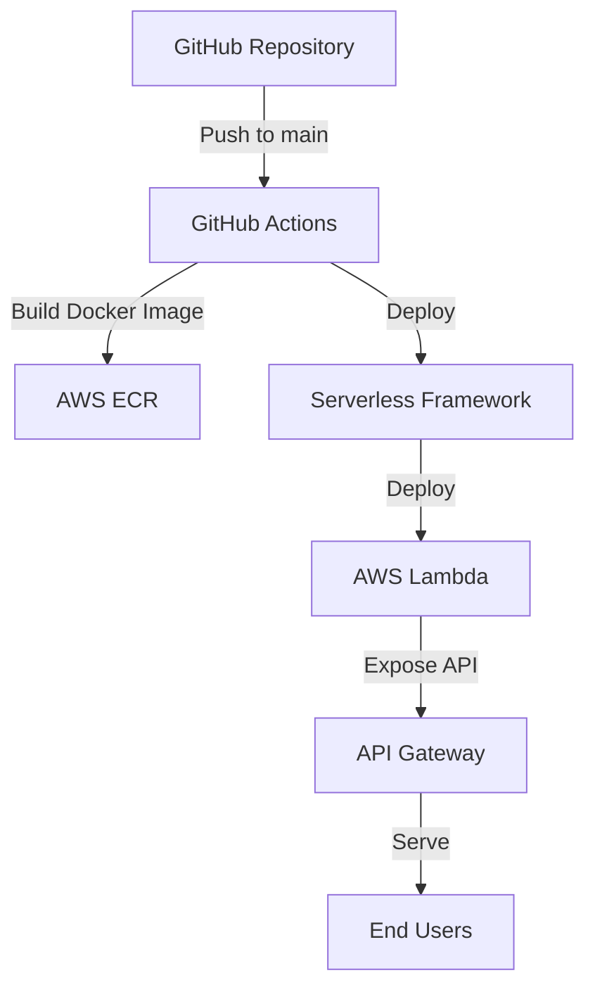

# Next Auth Example 아키텍처

## 개요

이 프로젝트는 Next.js와 NextAuth.js를 사용한 인증 예제 애플리케이션입니다. 이 애플리케이션은 다음과 같은 기술 스택을 사용합니다:

- **프론트엔드**: Next.js, React, TailwindCSS
- **인증**: NextAuth.js (beta)
- **배포**: AWS Lambda, API Gateway, ECR
- **CI/CD**: GitHub Actions
- **인프라**: Serverless Framework

## 시스템 아키텍처

## 배포 프로세스

1. 개발자가 코드를 main/master 브랜치에 푸시합니다.
2. GitHub Actions 워크플로우가 트리거됩니다.
3. 워크플로우는 다음 작업을 수행합니다:
   - 버전 범프
   - GitHub 릴리스 생성
   - Docker 이미지 빌드
   - AWS ECR에 이미지 푸시
   - Serverless Framework를 사용하여 AWS Lambda에 배포

## 애플리케이션 구조

- **app.js**: Express와 Next.js를 통합하는 서버 코드
- **app-local.js**: 로컬 개발 환경에서 애플리케이션을 실행하기 위한 스크립트
- **lambda.js**: AWS Lambda 핸들러 함수 (serverless-express를 사용하여 Express 앱을 Lambda 핸들러로 변환)
- **next.config.js**: Next.js 설정 (standalone 출력, 이미지 최적화 비활성화 등)
- **serverless.yml**: Serverless Framework 설정
- **auth.ts**: NextAuth.js 설정
- **app/**: Next.js 애플리케이션 코드
- **components/**: React 컴포넌트
- **lib/**: 유틸리티 함수

## Docker 이미지 구성

Docker 이미지는 멀티 스테이지 빌드를 사용하여 최적화되어 있습니다:

1. **의존성 설치 단계**: Node.js 환경에서 npm을 통해 pnpm을 전역 설치한 후, pnpm을 사용하여 필요한 패키지를 설치합니다.
2. **빌드 단계**: 설치된 의존성을 사용하여 Next.js 애플리케이션을 빌드합니다. 여기서도 npm을 통해 pnpm을 전역 설치합니다.
3. **실행 단계**: 빌드된 애플리케이션과 필요한 의존성만 포함하는 경량화된 이미지를 생성합니다.

실행 단계에서는 다음과 같은 환경 변수와 설정이 적용됩니다:
- `NODE_ENV=production`: 프로덕션 모드로 실행
- `NODE_PATH=/usr/local/lib/node_modules`: 전역 설치된 모듈을 require()로 불러올 수 있도록 설정
- `NEXT_TELEMETRY_DISABLED=1`: Next.js 텔레메트리 비활성화
- 필요한 패키지(express, @vendia/serverless-express, source-map-support)를 전역으로 설치

## AWS Lambda 배포

AWS Lambda에 배포할 때는 다음과 같은 설정이 적용됩니다:

1. **컨테이너 이미지 기반 배포**: ECR에 저장된 Docker 이미지를 Lambda 함수의 런타임으로 사용합니다.
2. **Lambda 핸들러**: Docker 이미지 내의 `lambda.handler` 함수가 API Gateway 요청을 처리합니다.
3. **환경 변수**: 인증에 필요한 환경 변수(AUTH_SECRET, AUTH_GITHUB_ID 등)가 Lambda 함수에 전달됩니다.
4. **API Gateway**: HTTP API를 통해 Lambda 함수를 외부에 노출합니다. API Gateway의 타임아웃은 30초(최대값)로 설정되어 있습니다. 응답 압축(1024바이트 이상)이 활성화되어 있어 대용량 응답의 전송 속도가 향상됩니다.
5. **API 키 및 사용량 계획**: API 키를 통한 접근 제어와 사용량 제한(월 5000건, 초당 100건, 버스트 200건)이 설정되어 있습니다.
6. **CORS 설정**: 모든 출처에서의 접근을 허용하며, 필요한 헤더(Content-Type, Authorization, X-Api-Key 등)를 명시적으로 지정하여 브라우저 간 호환성을 보장합니다. 특히 `X-Next-Init-Bypass` 헤더를 허용하여 초기화 우회 플래그를 전달할 수 있습니다.
6. **바이너리 미디어 타입**: 모든 미디어 타입(`*/*`)을 바이너리로 처리하도록 설정하여 이미지, CSS, JavaScript 등의 정적 파일을 올바르게 제공합니다.
7. **타임아웃 및 메모리**: Lambda 함수의 타임아웃은 60초, 메모리 크기는 3072MB로 설정되어 있습니다.
7. **X-Ray 트레이싱**: API Gateway와 Lambda의 X-Ray 트레이싱이 활성화되어 있어 요청 추적 및 성능 모니터링이 가능합니다.
8. **Warm-up**: Lambda 함수의 콜드 스타트 문제를 해결하기 위해 5분마다 함수를 호출하는 Warm-up 플러그인이 활성화되어 있습니다.
9. **극한의 지연 초기화**: Lambda 초기화 단계에서는 최소한의 모듈만 로드하고, Express 앱과 serverlessExpress 모듈도 첫 번째 요청에서 동적으로 로드합니다. 이를 통해 Lambda 초기화 시간을 10초 이내로 유지하여 타임아웃을 방지합니다.
10. **로딩 페이지 및 자동 새로고침**: Next.js 초기화가 완료될 때까지 사용자에게 로딩 페이지를 제공합니다. 로딩 페이지는 자동 새로고침 기능을 포함하여 초기화가 완료되면 자동으로 실제 페이지로 전환됩니다.
10. **정적 파일 처리**: Next.js 초기화 전에도 정적 파일(CSS, JavaScript, 이미지 등)을 제공할 수 있도록 Express 미들웨어를 추가했습니다. 이를 통해 초기화 중에도 로딩 페이지의 스타일과 스크립트가 올바르게 로드됩니다.

## 실행 모드

이 애플리케이션은 두 가지 실행 모드를 지원합니다:

1. **로컬 개발 모드**: `npm run dev` 또는 `docker-compose up`으로 실행하면 Next.js 개발 서버가 시작됩니다.
2. **Lambda 모드**: AWS Lambda에 배포되면 `lambda.js`의 핸들러 함수가 API Gateway 요청을 처리합니다.

Docker 이미지는 기본적으로 Lambda 모드로 실행되도록 설정되어 있으며, CMD 지시문에서 `lambda.js`를 실행합니다.
