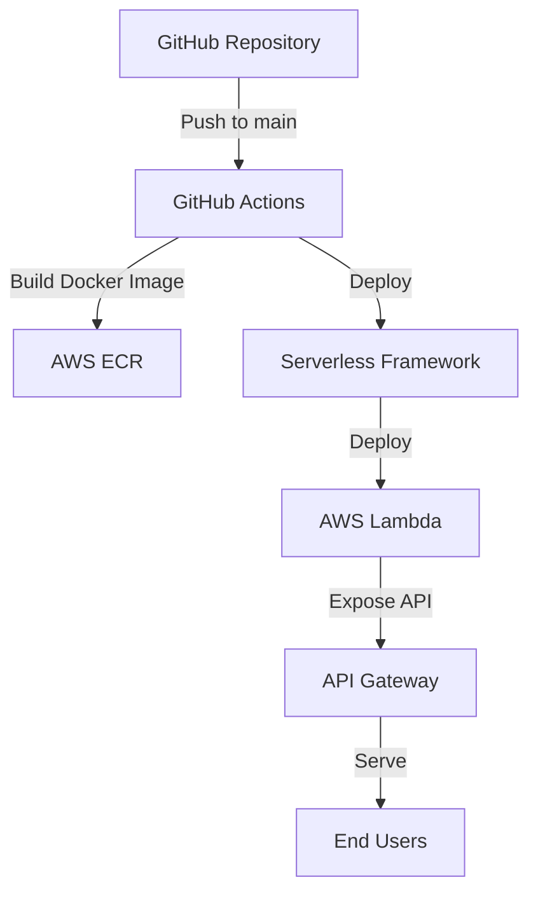

# Next Auth Example 아키텍처

## 개요

이 프로젝트는 Next.js와 NextAuth.js를 사용한 인증 예제 애플리케이션입니다. 이 애플리케이션은 다음과 같은 기술 스택을 사용합니다:

- **프론트엔드**: Next.js, React, TailwindCSS
- **인증**: NextAuth.js (beta)
- **배포**: AWS Lambda, API Gateway, ECR
- **CI/CD**: GitHub Actions
- **인프라**: Serverless Framework

## 시스템 아키텍처

## 배포 프로세스

1. 개발자가 코드를 main/master 브랜치에 푸시합니다.
2. GitHub Actions 워크플로우가 트리거됩니다.
3. 워크플로우는 다음 작업을 수행합니다:
   - 버전 범프
   - GitHub 릴리스 생성
   - Docker 이미지 빌드
   - AWS ECR에 이미지 푸시
   - Serverless Framework를 사용하여 AWS Lambda에 배포

## 애플리케이션 구조

- **app.js**: Express와 Next.js를 통합하는 서버 코드
- **app-local.js**: 로컬 개발 환경에서 애플리케이션을 실행하기 위한 스크립트
- **lambda.js**: AWS Lambda 핸들러 함수 (serverless-express를 사용하여 Express 앱을 Lambda 핸들러로 변환)
- **next.config.js**: Next.js 설정 (standalone 출력, 이미지 최적화 비활성화 등)
- **serverless.yml**: Serverless Framework 설정
- **auth.ts**: NextAuth.js 설정
- **app/**: Next.js 애플리케이션 코드
- **components/**: React 컴포넌트
- **lib/**: 유틸리티 함수

## Docker 이미지 구성

Docker 이미지는 멀티 스테이지 빌드를 사용하여 최적화되어 있습니다:

1. **의존성 설치 단계**: Node.js 환경에서 npm을 사용하여 필요한 패키지를 설치합니다. pnpm 대신 npm을 사용하고 `--no-package-lock` 옵션을 적용하여 패키지 무결성 검사 관련 문제를 방지합니다.
2. **빌드 단계**: 설치된 의존성을 사용하여 Next.js 애플리케이션을 빌드합니다.
3. **실행 단계**: 빌드된 애플리케이션과 필요한 의존성만 포함하는 경량화된 이미지를 생성합니다.

실행 단계에서는 다음과 같은 환경 변수와 설정이 적용됩니다:
- `NODE_ENV=production`: 프로덕션 모드로 실행
- `NODE_PATH=/usr/local/lib/node_modules`: 전역 설치된 모듈을 require()로 불러올 수 있도록 설정
- `NEXT_TELEMETRY_DISABLED=1`: Next.js 텔레메트리 비활성화
- 필요한 패키지(express, @vendia/serverless-express, source-map-support)를 전역으로 설치

## AWS Lambda 배포

AWS Lambda에 배포할 때는 다음과 같은 설정이 적용됩니다:

1. **컨테이너 이미지 기반 배포**: ECR에 저장된 Docker 이미지를 Lambda 함수의 런타임으로 사용합니다.
2. **Lambda 핸들러**: Docker 이미지 내의 `lambda.handler` 함수가 API Gateway 요청을 처리합니다.
3. **환경 변수**: 인증에 필요한 환경 변수(AUTH_SECRET, AUTH_GITHUB_ID 등)가 Lambda 함수에 전달됩니다.
4. **API Gateway**: HTTP API를 통해 Lambda 함수를 외부에 노출합니다.
5. **바이너리 미디어 타입**: 모든 미디어 타입(`*/*`)을 바이너리로 처리하도록 설정하여 이미지, CSS, JavaScript 등의 정적 파일을 올바르게 제공합니다.

## 실행 모드

이 애플리케이션은 두 가지 실행 모드를 지원합니다:

1. **로컬 개발 모드**: `npm run dev` 또는 `docker-compose up`으로 실행하면 Next.js 개발 서버가 시작됩니다.
2. **Lambda 모드**: AWS Lambda에 배포되면 `lambda.js`의 핸들러 함수가 API Gateway 요청을 처리합니다.

Docker 이미지는 기본적으로 Lambda 모드로 실행되도록 설정되어 있으며, CMD 지시문에서 `lambda.js`를 실행합니다.
