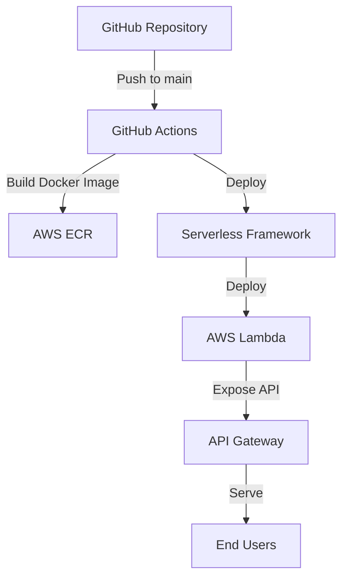

# Next Auth Example 아키텍처

## 개요

이 프로젝트는 Next.js와 NextAuth.js를 사용한 인증 예제 애플리케이션입니다. 이 애플리케이션은 다음과 같은 기술 스택을 사용합니다:

- **프론트엔드**: Next.js, React, TailwindCSS
- **인증**: NextAuth.js (beta)
- **배포**: AWS Lambda, API Gateway, ECR
- **CI/CD**: GitHub Actions
- **인프라**: Serverless Framework

## 시스템 아키텍처

## 배포 프로세스

1. 개발자가 코드를 main/master 브랜치에 푸시합니다.
2. GitHub Actions 워크플로우가 트리거됩니다.
3. 워크플로우는 다음 작업을 수행합니다:
   - 버전 범프
   - GitHub 릴리스 생성
   - Docker 이미지 빌드
   - AWS ECR에 이미지 푸시
   - Serverless Framework를 사용하여 AWS Lambda에 배포

## 애플리케이션 구조

- **app.js**: Express와 Next.js를 통합하는 서버 코드
- **app-local.js**: 로컬 개발 환경에서 애플리케이션을 실행하기 위한 스크립트
- **next.config.js**: Next.js 설정 (standalone 출력, 이미지 최적화 비활성화 등)
- **serverless.yml**: Serverless Framework 설정
- **auth.ts**: NextAuth.js 설정
- **app/**: Next.js 애플리케이션 코드
- **components/**: React 컴포넌트
- **lib/**: 유틸리티 함수
