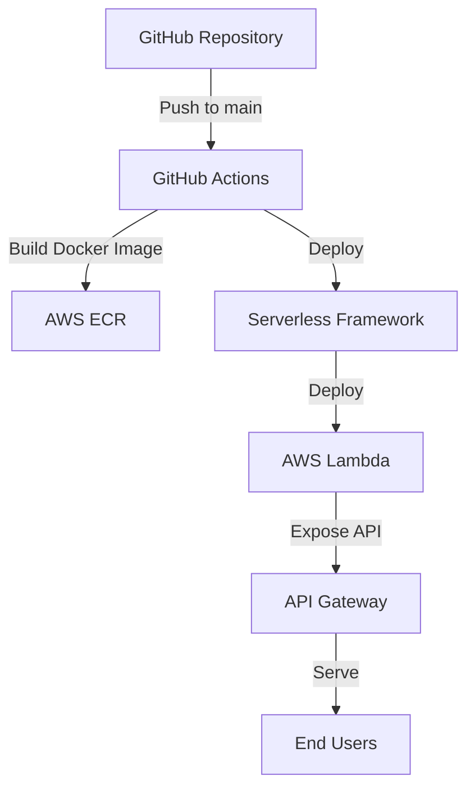

# Next Auth Example 아키텍처

## 개요

이 프로젝트는 Next.js와 NextAuth.js를 사용한 인증 예제 애플리케이션입니다. 이 애플리케이션은 다음과 같은 기술 스택을 사용합니다:

- **프론트엔드**: Next.js, React, TailwindCSS
- **인증**: NextAuth.js (beta)
- **배포**: AWS Lambda, API Gateway, ECR
- **CI/CD**: GitHub Actions
- **인프라**: Serverless Framework

## 시스템 아키텍처

## 배포 프로세스

1. 개발자가 코드를 main/master 브랜치에 푸시합니다.
2. GitHub Actions 워크플로우가 트리거됩니다.
3. 워크플로우는 다음 작업을 수행합니다:
   - 버전 범프
   - GitHub 릴리스 생성
   - Docker 이미지 빌드
   - AWS ECR에 이미지 푸시
   - Serverless Framework를 사용하여 AWS Lambda에 배포

## 애플리케이션 구조

- **app.js**: Express와 Next.js를 통합하는 서버 코드
- **app-local.js**: 로컬 개발 환경에서 애플리케이션을 실행하기 위한 스크립트
- **next.config.js**: Next.js 설정 (standalone 출력, 이미지 최적화 비활성화 등)
- **serverless.yml**: Serverless Framework 설정
- **auth.ts**: NextAuth.js 설정
- **app/**: Next.js 애플리케이션 코드
- **components/**: React 컴포넌트
- **lib/**: 유틸리티 함수

## 구현된 개선 사항

1. **Dockerfile 생성**: Docker 이미지 빌드를 위한 Dockerfile을 생성했습니다.
   - 빌드 단계와 실행 단계로 구분된 멀티 스테이지 빌드를 사용합니다.
   - Next.js 애플리케이션을 standalone 모드로 빌드합니다.
   - Lambda 핸들러 파일을 복사합니다.

2. **Lambda 핸들러 추가**: AWS Lambda에서 실행될 핸들러 함수를 추가했습니다.
   - lambda.js 파일에 AWS Lambda 핸들러 함수를 정의했습니다.
   - @vendia/serverless-express를 사용하여 Express 앱을 Lambda 핸들러로 변환합니다.
   - 소스맵 지원을 활성화하여 디버깅을 용이하게 합니다.
   - 로컬 개발 환경에서도 실행 가능하도록 구성했습니다.

3. **docker-compose.yml 생성**: 로컬 테스트를 위한 docker-compose.yml 파일을 생성했습니다.
   - 포트 매핑: 3000:3000
   - 환경 변수 설정: NODE_ENV, AUTH_SECRET, OAuth 관련 변수 등
   - 볼륨 마운트: public 디렉토리

4. **package.json 스크립트 추가**: 편의성을 위한 스크립트를 추가했습니다.
   - lambda: Lambda 핸들러 실행
   - docker:build: Docker 이미지 빌드
   - docker:run: Docker 컨테이너 실행

5. **serverless.yml 수정**: Lambda 핸들러를 지정했습니다.
   - handler: lambda.handler
